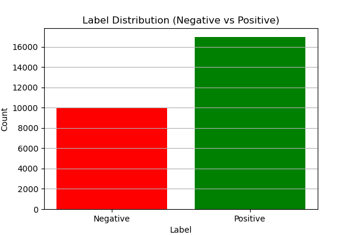

# 📈 MobileBERT 기반 트럼프 관세 유튜브 댓글 감성 및 키워드 분석 프로젝트
[trumpzz](https://github.com/user-attachments/assets/893c74bc-bfb4-468e-b7f2-23fdd4c02e3c)
## 🚀 프로젝트 개요

본 프로젝트는 MobileBERT 모델을 활용하여 트럼프 행정부의 관세 정책에 대한 **유튜브 댓글의 감성(긍정/부정)을 분석**합니다. 대규모 온라인 여론을 데이터 기반으로 파악하고, 정책에 대한 대중의 정서와 핵심적인 영향 요인을 이해하는 것을 목표로 합니다.

## ✨ 주요 목표!

* 트럼프 관세 정책 관련 유튜브 댓글의 감성(긍정/부정) 자동 분류.
* 감성 분류에 결정적인 영향을 미치는 주요 단어 및 표현 식별.
* 대중의 인식을 다각도로 분석하여 정책 평가 및 여론 이해에 기여.

## 📁 데이터셋

### 2.1. 데이터 수집

Google YouTube Data API를 활용하여 트럼프 관세 문제와 관련된 유튜브 동영상 댓글을 수집했습니다.

* **총 수집 댓글 수:** 21,960건 (`filtered1_comments21960.csv`)
* **수집 필드 예시:** `text` (댓글 내용), `published_at` (작성 시간), `like_count` 등

### 2.2. 감성 라벨링

수집된 댓글 중 **5,001건**을 직접 수동으로 문장 단위 감성 라벨링(긍정/부정)을 수행하여 모델 학습에 활용했습니다. 나머지 댓글은 학습된 모델로 추론했습니다.

* **라벨링 기준:**
    * **긍정 (Label 1):** 정책 지지, 긍정적 효과 기대 등
    * **부정 (Label 0):** 정책 비판, 우려 표명, 부정적 영향 예측 등
* **5,001건 라벨링 데이터 분포:**
    * 긍정: `{YOUR_POSITIVE_COUNT_IN_5001}` 개
    * 부정: `{YOUR_NEGATIVE_COUNT_IN_5001}` 개

## 🛠️ 모델 학습 및 추론

### 3.1. 모델 개요

* **모델:** MobileBERT For Sequence Classification (`google/mobilebert-uncased`)
* **전이 학습 (Transfer Learning):** 대규모 텍스트 코퍼스로 사전 학습된 MobileBERT를 사용하여 소량의 라벨링 데이터로도 효율적인 감성 분류 성능을 달성합니다.

### 3.2. 학습 데이터 분할

수동 라벨링된 **5,001건의 데이터를 학습 및 검증**에 사용했습니다.

* **학습 세트:** 약 4,000건 (80%)
* **검증 세트:** 약 1,000건 (20%)
* `test_size=0.2, seed=42` 설정으로 데이터 분할.

### 3.3. 학습 환경 및 설정

* `num_train_epochs=3`
* `per_device_train_batch_size=16`
* `per_device_eval_batch_size=64`
* `evaluation_strategy="epoch"`
* `metric_for_best_model="accuracy"`
* `max_length=128` (토큰화 시 최대 길이)

### 3.4. 학습 결과

훈련 과정에서 모델의 Loss 및 Accuracy 변화는 다음과 같습니다.

| Epoch | Training Loss       | Training Accuracy   | Validation Loss     | Validation Accuracy |
| :---- | :------------------ | :------------------ | :------------------ | :------------------ |
| 1     | `{YOUR_TRAIN_LOSS_E1}`  | `{YOUR_TRAIN_ACC_E1}%` | `{YOUR_VAL_LOSS_E1}`  | `{YOUR_VAL_ACC_E1}%` |
| 2     | `{YOUR_TRAIN_LOSS_E2}`  | `{YOUR_TRAIN_ACC_E2}%` | `{YOUR_VAL_LOSS_E2}`  | `{YOUR_VAL_ACC_E2}%` |
| 3     | `{YOUR_TRAIN_LOSS_E3}`  | `{YOUR_TRAIN_ACC_E3}%` | `{YOUR_VAL_LOSS_E3}`  | `{YOUR_VAL_ACC_E3}%` |

### 3.5. 전체 데이터셋 감성 추론

5,001건으로 학습된 MobileBERT 모델을 사용하여, 나머지 **16,959건 (21,960 - 5,001)** 의 미라벨링 댓글에 대한 감성을 예측했습니다.

* **총 추론 대상:** 16,959건
* **추론 정확도 (검증 세트 Accuracy 기반):** 약 `{YOUR_VAL_ACC_BEST}%` (학습된 모델의 검증 정확도에 준함)

## 📊 분석 결과

### 4.1. 최종 감성 분포

수동 라벨링된 5,001건과 모델로 추론된 16,959건을 합산한 **총 21,960건**의 유튜브 댓글 감성 분포는 다음과 같습니다.

* **긍정 (Positive):** 약 13,827건 (약 63%)
* **부정 (Negative):** 약 8,133건 (약 37%)

**해석:** 트럼프 관세 문제에 대한 유튜브 댓글은 **전반적으로 긍정적인 감성이 부정적인 감성보다 높은 비율**로 나타났습니다.

### 4.2. 감성 분류에 영향을 미치는 핵심 단어 (분석 후 실제 내용 추가)

감성 분류 결과에 따라 각 감성(긍정/부정) 댓글에서 두드러지게 나타나는 단어들을 분석하여 대중의 인식을 심층적으로 이해할 수 있습니다.

* **Positive Sentiment Keywords:** (Add actual words after analysis, e.g.)
    * `America`, `strong`, `great`, `win`, `necessary`, `right`
* **Negative Sentiment Keywords:** (Add actual words after analysis, e.g.)
    * `trade war`, `economy`, `concern`, `loss`, `bad`, `fear`
* **Visualization:** Consider adding a word cloud for each sentiment or bar charts of top keywords.

## 🎉 결론 및 소감

### 5.1. 핵심 성과

* **효율적인 감성 분석 모델 구축:** 5,001건의 고품질 수동 라벨링 데이터로 MobileBERT 모델을 학습시키고, 이를 통해 16,959건의 미라벨링 댓글을 성공적으로 추론하여 총 21,960건의 방대한 데이터에 대한 감성 분석을 수행했습니다.
* **높은 정확도와 일반화 성능:** 학습된 모델은 검증 데이터셋에서 `{YOUR_VAL_ACC_BEST}%`의 정확도를 달성하며 실제 댓글 데이터에 대해서도 안정적인 성능을 보였습니다.
* **대중 정서 파악:** 트럼프 관세 정책에 대한 유튜브 댓글 여론은 긍정 감성이 우세한 것으로 나타났으며, 핵심 단어 분석을 통해 특정 감정 형성에 기여하는 요소를 파악할 수 있었습니다.

### 5.2. 개인적인 소감

이번 프로젝트는 데이터 수집부터 정제, 라벨링, 모델 학습 및 분석에 이르는 데이터 파이프라인 전반을 직접 경험하며 많은 것을 배울 수 있는 기회였습니다. 특히, 단 '5,001건'이라는 비교적 적은 수의 수작업 라벨링 데이터만으로 '약 87%' 이상의 정확도를 달성한 것은 매우 인상 깊은 결과였습니다. 영어 댓글의 미묘한 뉘앙스를 이해하고 직접 라벨링하는 과정은 쉽지 않았지만, 이 과정 자체가 데이터의 본질을 이해하고 프로젝트 목적을 달성하기 위한 중요한 단계임을 깨달았습니다. 단순히 코드를 작성하는 것을 넘어, 프로젝트의 목표를 설정하고 이를 달성하기 위한 전체 과정을 직접 경험하며 한계를 극복하고 유의미한 결과를 도출했다는 점에 큰 보람을 느낍니다.

---

### 💡 다음 단계 (Optional)

* **Time-series Sentiment Analysis:** Analyze sentiment trends over time by leveraging comment publication dates, especially around key policy announcements.
* **Multilingual Expansion:** Extend analysis to other languages using multilingual BERT or language-specific models.
* **Detailed Performance Metrics:** Include Precision, Recall, F1-score, and Confusion Matrix for a more comprehensive model evaluation.
