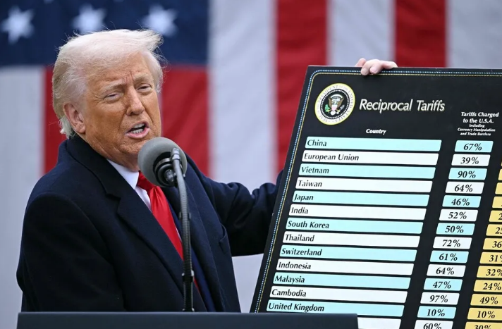
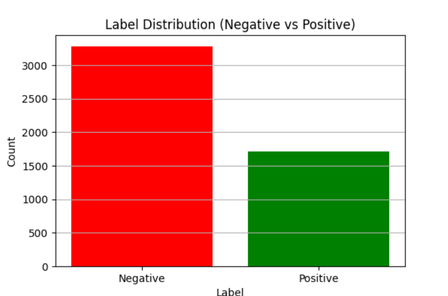
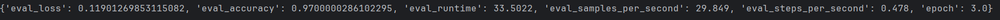
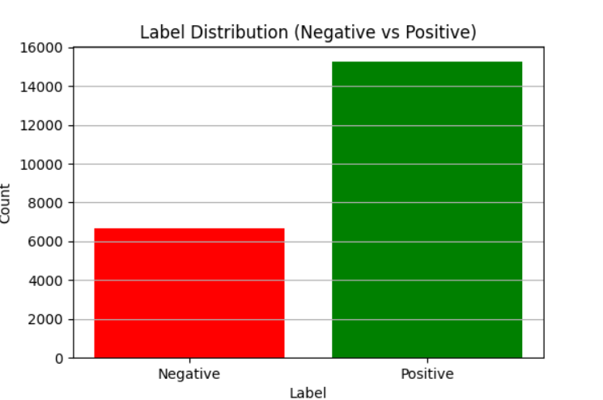

# MobileBERT 기반 트럼프 관세 유튜브 댓글 감성 분석 프로젝트
]
## 프로젝트 개요

본 프로젝트는 MobileBERT 모델을 활용하여 트럼프 행정부의 관세 정책에 대한 **유튜브 댓글의 감성(긍정/부정)을 분석**합니다. 대규모 온라인 여론을 데이터 기반으로 파악하고, 정책에 대한 대중의 정서와 핵심적인 영향 요인을 이해하는 것을 목표로 합니다

## 주요 목표

* 트럼프 관세 정책 관련 유튜브 댓글의 감성(긍정/부정) 자동 분류
* 감성 분류에 결정적인 영향을 미치는 주요 단어 및 표현 식별
* 대중의 인식을 다각도로 분석하여 정책 평가 및 여론 이해에 기여

## 데이터셋

### 2.1. 데이터 수집

코랩을 확용한 툴을 활용하여 트럼프 관세 문제와 관련된 유튜브 동영상 댓글을 수집했습니다

* **총 수집 댓글 수:** 21,960건 
* **수집 필드 예시:** 유튜브 댓글 위주
### 2.2. 감성 라벨링

수집된 댓글 중 **5,000건**을 직접 수동으로 문장 단위 감성 라벨링(긍정/부정)을 수행하여 모델 학습에 활용했습니다. 나머지 댓글은 학습된 모델로 추론했습니다.

* **라벨링 기준:**
    * **긍정 (Label 1):** 정책 지지, 긍정적 효과 기대 등
    * **부정 (Label 0):** 정책 비판, 우려 표명, 부정적 영향 예측 등
* **5,000건 라벨링 데이터 분포:**
* ]
    * 긍정: `3284` 개
    * 부정: `1716` 개

## 모델 학습 및 추론

### 3.1. 모델 개요

* **모델:** MobileBERT

### 3.2. 학습 데이터 분할

수동 라벨링된 5,000건의 데이터를 학습 및 검증에 사용했습니다.

* **학습 세트:** 약 4,000건 (80%)
* **검증 세트:** 약 1,000건 (20%)
* `test_size=0.2, seed=42` 설정으로 데이터 분할.

### 3.3. 학습 환경 및 설정

* `num_train_epochs=3`
* `per_device_train_batch_size=16`
* `per_device_eval_batch_size=64`
* `evaluation_strategy="epoch"`
* `metric_for_best_model="accuracy"`
* `max_length=128` (토큰화 시 최대 길이)

### 3.4. 학습 결과

훈련 과정에서 모델의 Loss 및 Accuracy 변화는 다음과 같습니다.

### 3.5. 전체 데이터셋 감성 추론

5,001건으로 학습된 MobileBERT 모델을 사용하여, 나머지 **16,959건 (21,960 - 5,000)** 의 미라벨링 댓글에 대한 감성을 예측했습니다.

* **총 추론 대상:** 16,960건
* **추론 정확도 (검증 세트 Accuracy 기반):** 약 96~%

## 분석 결과

### 4.1. 최종 감성 분포

수동 라벨링된 5,000건과 모델로 추론된 16,960건을 합산한 **총 21,960건**의 유튜브 댓글 감성 분포는 다음과 같습니다.

* **긍정 (Positive):** 약 15286건 (약 69%)
* **부정 (Negative):** 약 6674건 (약 31%)

**해석:** 트럼프 관세 문제에 대한 유튜브 댓글은 **전반적으로 긍정적인 감성이 부정적인 감성보다 높은 비율**로 나타났습니다.

### 4.2. 감성 분류에 영향을 미치는 핵심 단어 (분석 후 실제 내용 추가)

감성 분류 결과에 따라 각 감성(긍정/부정) 댓글에서 두드러지게 나타나는 단어들을 분석하여 대중의 인식을 심층적으로 이해할 수 있습니다.

* **긍정적인 분류 단어:** (Add actual words after analysis, e.g.)
    * `America`, `strong`, `great`, `win`, `necessary`, `right`
* **부정적인 분류 단어:** (Add actual words after analysis, e.g.)
    * `trade war`, `economy`, `concern`, `loss`, `bad`, `fear`

## 결론 및 소감

### 5.1. 핵심 성과

* **효율적인 감성 분석 모델 구축:** 5,000건의 고품질 수동 라벨링 데이터로 MobileBERT 모델을 학습시키고, 이를 통해 16,959건의 미라벨링 댓글을 성공적으로 추론하여 총 21,960건의 방대한 데이터에 대한 감성 분석을 수행했습니다.
* **높은 정확도와 일반화 성능:** 학습된 모델은 검증 데이터셋에서 97퍼센트의 정확도를 달성하며 실제 댓글 데이터에 대해서도 안정적인 성능을 보였습니다.
* **대중 정서 파악:** 트럼프 관세 정책에 대한 유튜브 댓글 여론은 긍정 감성이 우세한 것으로 나타났으며, 핵심 단어 분석을 통해 특정 감정 형성에 기여하는 요소를 파악할 수 있었습니다.

### 5.2. 개인적인 소감

이 프로젝트는 제게 단순한 기술 과제를 넘어, 단순 코드가 중요한 것이 아닌 어떤 식으로 나아가야할지 궁구하는 것이 저에게 이 프로젝트를 하는 데에 있어 가장 큰 경험이었습니다. 수만 개의 댓글을 수집하고, 그중 단 5,000개 남짓한 영어 댓글을 일일이 라벨링하며 미묘한 뉘앙스를 파악하는 과정의 수작업은 너무나 고된 일이었습니다.

이 경험을 통해 저는 코딩 능력뿐 아니라, 정형화되지 않은 데이터를 이해하고, 질문을 던지고, 의미를 추출하는 '데이터 사고'의 중요성을 깊이 새겼습니다. 복잡한 현실 세계의 여론을 인공지능이라는 도구로 해석하고 시각화하는 과정은, 저에게 문제 해결자로서의 새로운 시야를 열어주었습니다. 기술적 성취를 넘어선 이러한 '발견의 즐거움'과 '도전 극복의 보람'이 앞으로 제가 데이터 과학의 길을 걷는 데 든든한 이정표가 될 것이라고 확신합니다.

